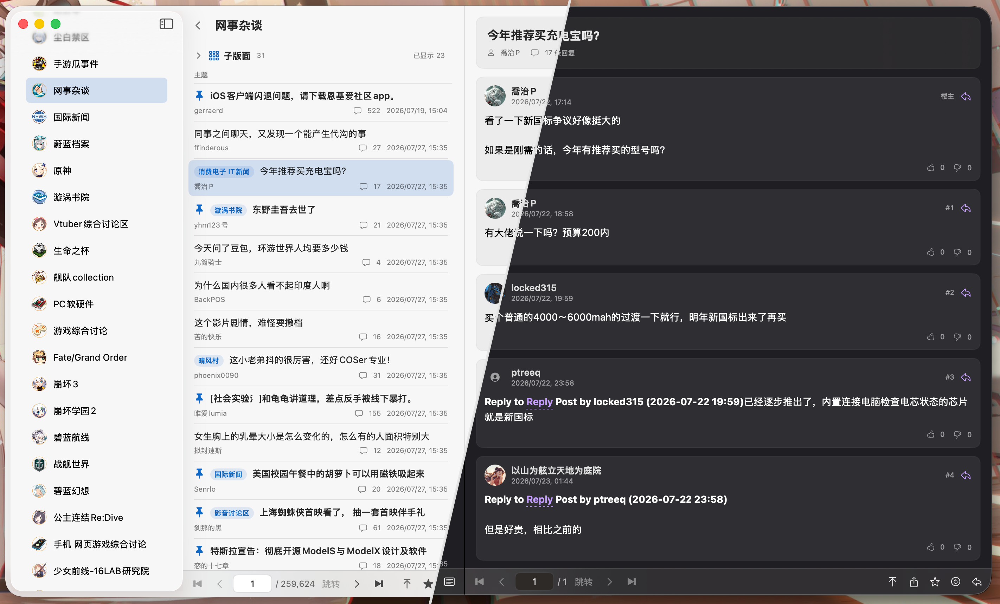

# SNGA (Super NGA)

<p align="center">
  
</p>

SNGA 是一个面向 macOS 26 的原生 NGA 论坛客户端，当前版本为 1.7.1。项目初衷是为了方便上班摸鱼，后续会根据使用情况继续完善。

项目使用 SwiftUI 构建，登录流程由 NGA 官方网页完成，并通过独立的网络与解析适配层访问论坛。

> SNGA 是非官方客户端，与 NGA 官方没有从属关系。NGA 未提供稳定的公开 API，页面或接口调整可能导致部分功能暂时不可用。

## 1.7.1 更新

- 侧边栏增加“最近访问”，按访问顺序展示版面及图标；设置中可自定义保留 1～30 条记录
- 话题楼层使用更紧凑的两行作者信息布局，展示级别、声望、注册时间、威望和徽章
- 优化用户头像与默认头像尺寸，并修复部分楼层用户名和发帖时间缺失的问题
- 完善置顶话题的复杂表格、横幅、UBB 标签、滚动窗口及滚动按钮适配
- 统一界面中的“话题”用语，减少“主题”与“话题”混用
- 签到结果只展示可读状态，不再显示用户 ID、任务参数或时间戳

## 界面预览




## 主要功能

### 账号与登录

- 支持添加、切换、重新登录和移除多个 NGA 账号
- 在内置 `WKWebView` 中使用 NGA 官方扫码或密码登录，不读取和保存密码
- 每个账号使用独立的会话 Cookie、网络客户端、收藏、草稿及子板块偏好
- 会话保存在应用沙盒的本地目录，避免启动时反复请求钥匙串授权
- 避免将单个受限板块或消息接口的偶发鉴权失败错误判断为整个账号失效

### 板块与话题列表

- 按 NGA 官方分组展示板块目录，分组支持展开和收起
- “全部版面”支持按板块名称、简介、分类和板块 ID 搜索
- 侧边栏按访问顺序展示最近访问版面及其图标
- 最近访问数量可在设置中配置为 1～30 条，超出数量的旧记录会自动清理
- 按账号收藏常用板块，并优先与 NGA 站端同步；站端不支持时可退回本地收藏
- 切换收藏板块时自动刷新话题列表、回到顶部并显示骨架屏动画
- 支持主板块与子板块，子板块列表可折叠
- 第一次进入板块时使用网页默认的子板块选择，之后保存每个账号的选择
- 主板块话题列表可标识话题所属子板块，点击子板块可进入对应列表
- 正确处理版面镜像话题并跳转到目标板块
- 话题列表支持分页、首页/尾页和指定页跳转
- 话题列表支持按最新回复或最新话题排序，并可切换只显示精华话题
- 话题列表工具栏支持直接打开当前版面的置顶话题
- 话题列表支持一键回到顶部
- 底部翻页与操作栏支持自适应紧凑布局，操作按钮固定在右侧
- 底部按钮提供鼠标悬停高亮和按下反馈
- 支持鼠标悬停与当前话题选中高亮，发帖时间使用静态格式
- 支持 NGA 话题标题颜色，并自动修复部分列表接口产生的 UTF-8/GB18030 乱码

### 收藏夹

- 同步 NGA 账号的话题收藏夹，并按收藏目录分页浏览话题
- 可新建、重命名和删除收藏夹，设置公开状态及默认收藏夹
- 可从话题底部菜单将话题加入一个或多个收藏夹，或一次取消全部收藏
- 收藏夹显示话题数量，并支持从当前目录快速移除话题
- 板块收藏与话题收藏夹相互独立，均按账号隔离

### 话题浏览

- 话题列表与话题内容保持分栏浏览
- 话题列表和话题内容在加载、刷新及翻页时使用骨架屏动画
- 支持帖子分页、首页/尾页和指定页跳转
- 支持只看话题作者，并使用筛选结果的独立分页信息
- 支持一键回到话题内容顶部
- 展示话题标题、楼层、作者、头像、级别、声望、注册时间、威望、徽章、发帖时间、发帖设备及引用关系
- 点击用户名或头像可打开用户中心，点击楼层引用可跳转到目标楼层
- 正文中的 NGA 话题、楼层、版面和用户链接会在应用内打开；关联话题跳转与多级返回使用骨架屏过渡动画
- 支持热点回复，并在楼主与普通回复之间使用不同背景显示
- 支持楼层点赞、点踩及数量展示
- 支持话题投票的单选、多选、分组、截止时间、结果展示及站端提交
- 支持话题评分汇总、回复评分展示，并可在回复时选择评分一并提交
- 支持图片、表情、表格、列表、分隔线、代码、引用和折叠内容
- 点击帖子图片可在窗口内放大预览，并可复制图片、复制地址、另存为或在浏览器中打开
- 可复制话题网页链接或使用默认浏览器打开
- 正确识别已锁定帖子；打开锁帖或点击回复时显示锁定提示

### 回复编辑器

- 支持回复话题、指定楼层回复和引用
- 提供可视化 UBB 编辑器、源码编辑和实时预览三种模式
- 支持粗体、斜体、下划线、删除线、引用、代码、折叠、链接、图片、颜色、字号和对齐
- 内置 NGA 常用表情选择器
- 按“账号 + 话题”自动保存回复草稿
- 提交前读取 NGA 官方表单校验字段；写请求只提交一次，结果不明确时不会自动重试

### 用户中心

- 展示头像、用户名、UID、用户组、注册时间、发帖数、属地、签名等资料
- 展示威望、声望和 N 币
- 提供用户发布的“话题”和“回复”分页列表
- 当前账号显示每日签到状态；未签到或失败时可点击状态卡签到
- 帖子内可直接打开其他用户的用户中心

### 小工具

- 提供“每天 60s 读懂世界”、AI 资讯快报和实时 IT 资讯
- 提供抖音热搜、小红书热点、哔哩哔哩热搜、微博热搜和知乎话题榜
- “每天 60s 读懂世界”的图片支持通过右键菜单复制
- 设置中可切换官方实例或填写自定义实例地址
- 接口与实例信息可查阅 [60s API 在线文档](https://docs.60s-api.viki.moe/5831581m0)

### 消息、签到与通知

- 论坛消息提供“短消息”和统一“通知”视图；通知会按时间混排回复、评价、@ 与短消息事件
- 短消息与通知均展示已读/未读状态，打开消息后自动标记为已读；通知支持一键全部已读
- 通知使用账号级本地状态保留已读结果，避免轮询接口提前清除服务端未读标记
- 支持短消息分页加载，以及回复、评价、引用和 @ 通知类型识别
- 兼容 NGA 将提醒数据封装在脚本字符串中的当前响应格式
- 支持查看私信详情并回复已有私信
- 应用启动、回到前台及运行期间每五分钟检查全部有效账号
- 按北京时间执行每日签到，并识别“已经签到”的站端结果
- 签到状态会过滤接口内部的用户 ID、任务参数和时间戳，仅保留可读结果
- 首次消息同步只建立未读基线，之后仅通知新增事件
- 系统通知仅显示账号和消息类型，不显示发送者或正文
- 点击通知后切换到对应账号并打开相关消息

### 外观与偏好设置

- 提供“跟随系统、明亮、深色、NGA 暖金、午夜蓝、自定义”六种主题
- 自定义主题可分别选择背景颜色和突出颜色
- 原生界面、帖子正文和回复编辑器会同步切换配色
- 支持无图模式：正文图片默认显示为占位框，点击后再加载，表情不受影响
- 支持配置小工具 API 实例，并在保存前校验自定义地址
- 设置页可统一添加、重新登录或移除账号，并查看后台签到与消息检查策略
- 可选启用按日运行日志，并将日志目录改为用户选择的位置
- 包含适配 macOS 的完整尺寸应用图标资源

## 系统要求

- macOS 26.0 或更高版本
- Xcode 26.6 或更高版本
- Swift 6

项目使用以下系统框架：

- SwiftUI
- SwiftData
- WebKit
- UserNotifications

HTML 解析使用固定版本的 [SwiftSoup 2.13.6](https://github.com/scinfu/SwiftSoup/releases/tag/2.13.6)。

## 构建与运行

1. 使用 Xcode 打开 `SNGA.xcodeproj`。
2. 选择 `SNGA` scheme 和 `My Mac`。
3. 首次构建时等待 Swift Package Manager 下载 SwiftSoup。
4. 点击 Run，随后在应用内使用 NGA 官方页面登录。

命令行 Debug 构建：

```sh
xcodebuild -project SNGA.xcodeproj \
  -scheme SNGA \
  -configuration Debug \
  -derivedDataPath .build/DerivedData \
  CODE_SIGNING_ALLOWED=NO \
  build
```

运行单元测试：

```sh
xcodebuild -project SNGA.xcodeproj \
  -scheme SNGA \
  -destination 'platform=macOS' \
  -derivedDataPath .build/DerivedData \
  CODE_SIGNING_ALLOWED=NO \
  -only-testing:SNGATests \
  test
```

运行 UI 测试需要可启动的本机签名配置：

```sh
xcodebuild -project SNGA.xcodeproj \
  -scheme SNGA \
  -destination 'platform=macOS' \
  -derivedDataPath .build/DerivedData \
  -only-testing:SNGAUITests \
  test
```

## 数据与安全

- 账号元数据、收藏、草稿、子板块偏好和签到记录由 SwiftData 保存。
- 会话 Cookie 按账号保存在应用沙盒的 `Application Support/SNGA/Sessions` 中；目录权限为 `0700`，文件权限为 `0600`。
- 客户端不保存 NGA 密码，但本地 Cookie 仍属于敏感登录凭据，请保护好 macOS 用户账户和设备。
- 每个账号通过独立客户端和显式 `Cookie` 请求头访问 NGA，不使用共享 Cookie 容器。
- 普通网络请求使用临时 `URLSession`，禁用系统 Cookie 接收和共享缓存。
- 帖子 HTML 会移除脚本、表单、iframe、事件属性和不安全链接，并通过 CSP 限制远程资源。
- 运行日志默认关闭；启用后按日写入，不记录请求正文、Cookie 或登录令牌。
- 应用启用了 App Sandbox 和 Hardened Runtime，仅声明客户端网络访问及用户主动选择目录的读写权限。

## 测试范围

当前测试覆盖：

- NGA 结构化响应与 HTML 回退解析
- UTF-8、GB18030 和 HTML 实体解码
- 板块、子板块、置顶话题、镜像话题、话题颜色、排序、精华筛选、列表乱码修复、楼层设备、热点回复和用户资料解析
- 全部版面搜索与小工具 API、热榜、实例回退及自定义地址解析
- 富文本、列表、折叠内容、表情及附件渲染
- 无图模式延迟加载正文图片并保留表情显示
- 多账号 Cookie 隔离和本地会话存储
- 板块收藏合并、话题收藏夹接口、子板块偏好和北京时间签到策略
- 回复表单预检、锁帖错误识别、单次提交及写请求不重试
- 楼层评价、话题投票、话题评分、消息未读策略、通知目标、话题分页和分享入口
- 运行日志敏感凭据脱敏

## 致谢

- [60s API](https://github.com/vikiboss/60s)：为小工具模块提供开放的数据接口与实例支持

## 当前限制

- 不支持发布新话题
- 不支持本地图片上传
- 不支持新建陌生人私信、删除私信或批量操作
- 不提供论坛全文搜索、离线全文归档和自动更新
- 应用退出后不会签到、轮询消息或运行独立后台进程
- 尚未包含 Developer ID 签名、公证、安装包或 App Store 发布配置
- NGA 页面结构变化时可能出现可诊断的解析错误，但不会删除已保存的账号、收藏和草稿
